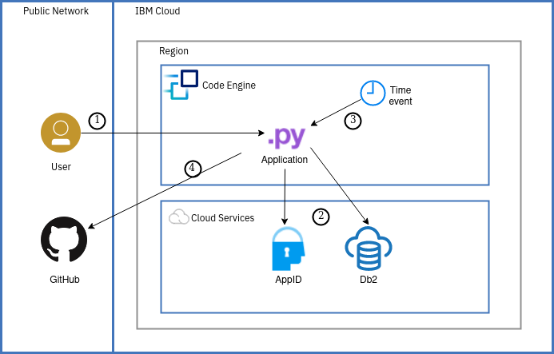
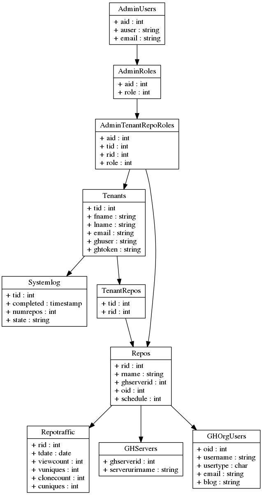

# Github Traffic Analytics: Combining serverless web app and eventing
This repository contains code based on this [IBM Cloud solution tutorial](https://cloud.ibm.com/docs/solution-tutorials?topic=solution-tutorials-serverless-github-traffic-analytics). In the tutorial, we create an application to automatically collect Github traffic statistics for repositories and provide the foundation for traffic analytics. Github only provides access to the traffic data for the last 14 days. If you want to analyze statistics over a longer period of time, you need to download and store that data yourself. The app and the serverless action discussed in the tutorial implement a multi-tenant-ready solution to manage repositories, automatically collect traffic data on a daily or weekly schedule, and to view and analyze the collected data.

The original solution was based on Cloud Foundry for the web app and Cloud Functions for the automatic, serverless collection of traffic data. The code has been modified into a single Python app. It runs as dockerized container within IBM Cloud Code Engine. The app can be accessed via its web interface as regular web app. Moreover, utilizing eventing, the app receives signals (time events) to automatically collect GitHub traffic data. If not active, IBM Cloud Code Engine automatically scales down the app.

Flow:
1. User accesses the Python (web) app running in IBM Cloud Code Engine. This is to set up the managed GitHub repositories or to access the collected traffic data.
2. The app interacts with the IBM AppID service for authentication and user management and Db2 as database for user and GitHub traffic data.
3. A Code Engine ping subscription based contacts the Python app to signal a time event.
4. Based on the signaled event (3) or directed by an administrator (user), the Python app retrieves GitHub traffic data.

## Rough steps (for now)
Many of the Code Engine-related steps can be performed in the UI (console), all using the CLI

- cd into the backend directory
- create a Code Engine project
- create an AppID and Db2 service instance (lite plan is ok)
- build the Docker image, e.g. using `ibmcloud cr build`
- register the container registry in Code Engine
- copy [.env.template](backend/.env.template) to .env. Edit it, remove unused lines. The minimum to change is FULL_HOSTNAME and EVENT_TOKEN. See below on service binding
- Create a Code Engine secret from the .env file, e.g., `ibmcloud ce secret create -name SERCRETNAME --from-env-file .env`
- deploy the app (Docker container) to Code Engine, use the secret from before, e.g., `ibmcloud ce app create --name APPNAME --image us.icr.io/namespace/imagename:latest --env-from-secret SECRETNAME --rs REGISTRY_CREDS`. 
- either bind AppID and Db2 services to the app or pass credentials in the secret (see above)
- access the app similar to described in the tutorial, initialize the app and also set the redirect URI in AppID
- add some repos in the app
- set up daily collection of traffic data by creating a subscription, e.g, `ibmcloud ce subscription ping create --name dailyStats --destination APPNAME --path /collectStats --schedule '0 6 * * *' --data '{"token":"value_from_EVENT_TOKEN"}'`

## Related blogs
* [Tutorial: GitHub Traffic Analytics with Cloud Functions and Cloud Foundry](https://www.ibm.com/blogs/bluemix/2018/04/tutorial-github-traffic-analytics/)
* [Use Db2 and IBM Cloud to analyze GitHub traffic data (tutorial)](http://blog.4loeser.net/2018/04/use-db2-and-ibm-cloud-to-analyze-github.html)
* [Automated, regular database jobs with IBM Cloud Functions (and Db2)](http://blog.4loeser.net/2018/04/automated-regular-database-jobs-with.html)
* [Securing your Python app with OpenID Connect (OIDC)](http://blog.4loeser.net/2018/06/securing-your-python-app-with-openid.html)
* [How to pack serverless Python actions](http://blog.4loeser.net/2018/05/how-to-pack-serverless-python-actions.html)

## Files in this repository
The files in this repository have the following structure:
* [backend](backend): Has the code for the Python-based server app, using the Flask framework
* [slack](slack): Automated weekly reporting of GitHub statistics into Slack channels (not part of the tutorial)

Important files in the **backend** directory:
* [ghstats.py](backend/ghstats.py): Flask app to manage repositories and their traffic data
* [database.sql](backend/database.sql): SQL script (for Db2) which is read and executed by the app during initialization.

The database schema, defined in [database.sql](backend/database.sql), can be graphically represented as (source in [Graphviz DOT notation](https://www.graphviz.org/documentation/) in [dbschema.gv.txt](dbschema.gv.txt)):

# License
See [LICENSE](LICENSE) for license information.

# Contribute / Contact Information
If you have found errors or some instructions are not working anymore, then please open an GitHub issue or, better, create a pull request with your desired changes.

You can find more tutorials and sample code at:
https://cloud.ibm.com/docs/solution-tutorials?topic=solution-tutorials-tutorials
