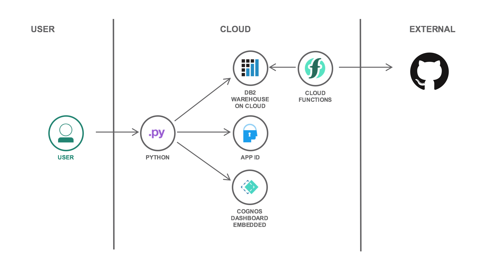
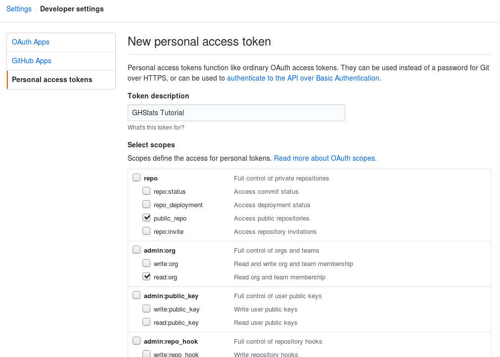
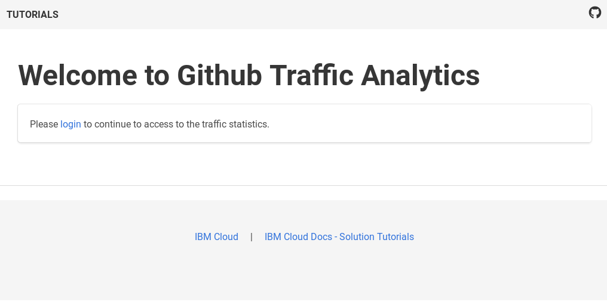
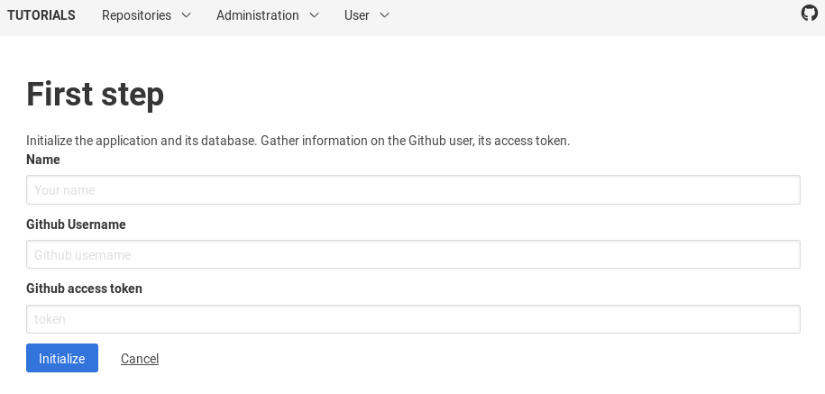
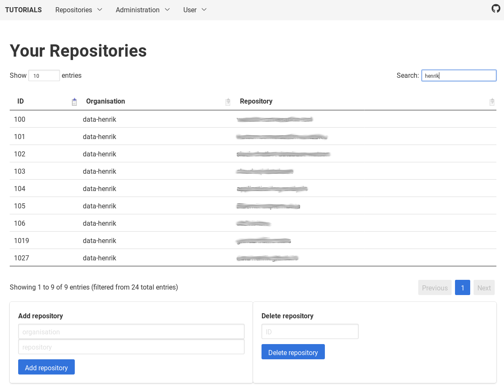
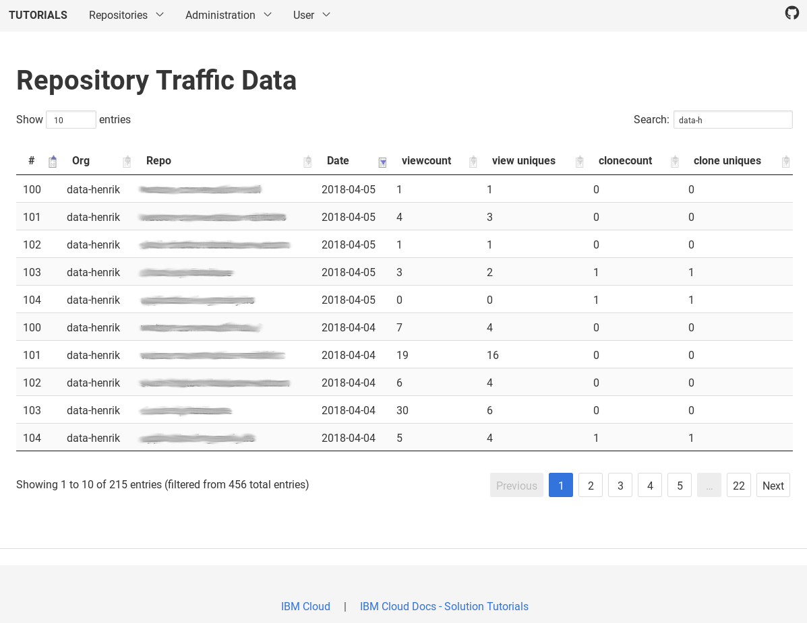
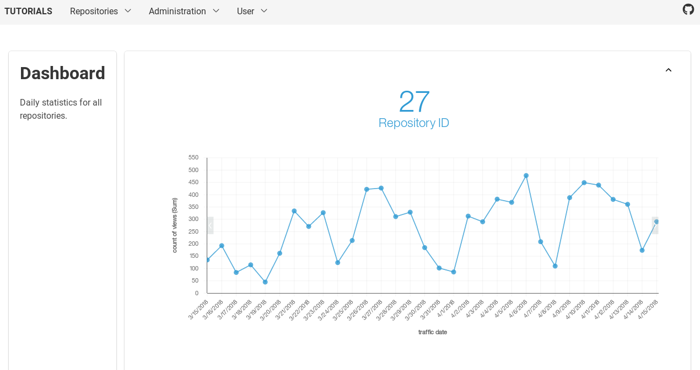

# Instructions for old version of an IBM Cloud Solution Tutorial
The following are the instructions for a former version of the tutorial [Serverless web app and eventing for data retrieval and analytics](https://cloud.ibm.com/docs/solution-tutorials?topic=solution-tutorials-serverless-github-traffic-analytics). It is not guaranteed to work and provided as-is.


# Combining serverless and Cloud Foundry for data retrieval and analytics
This tutorial may incur costs. Use the [Cost Estimator](https://cloud.ibm.com/estimator/review) to generate a cost estimate based on your projected usage.

In this tutorial, you create an application to automatically collect GitHub traffic statistics for repositories and provide the foundation for traffic analytics. GitHub only provides access to the traffic data for the last 14 days. If you want to analyze statistics over a longer period of time, you need to download and store that data yourself. In this tutorial, you deploy a serverless action to retrieve the traffic data and store it in a SQL database. Moreover, a Cloud Foundry app is used to manage repositories and provide access to the statistics for data analytics. The app and the serverless action discussed in this tutorial implement a multi-tenant-ready solution with the initial set of features supporting single-tenant mode.




## Objectives

* Deploy a Python database app with multi-tenant support and secured access
* Integrate App ID as OpenID Connect-based authentication provider
* Set up automated, serverless collection of GitHub traffic statistics
* Integrate Cognos Dashboard Embedded for graphical traffic analytics

## Before you begin
This tutorial requires:
* IBM Cloud CLI,
   * IBM Cloud Functions plugin (`cloud-functions`),
* `git` to clone source code repository,
* a GitHub account.

You will find instructions to download and install these tools for your operating environment in the [Getting started with tutorials](https://cloud.ibm.com/docs/solution-tutorials?topic=solution-tutorials-tutorials) guide.

## Service and Environment Setup (shell)
In this section, you set up the needed services and prepare the environment. All of this can be accomplished from the shell environment.

1. Clone the [GitHub repository](https://github.com/IBM-Cloud/github-traffic-stats/tree/cloudfoundry) and navigate into the cloned directory and its **backend** subdirectory:
   ```sh
   git clone https://github.com/IBM-Cloud/github-traffic-stats/tree/cloudfoundry
   cd github-traffic-stats/backend
   ```


2. Use `ibmcloud login` to log in interactively into IBM Cloud. You can reconfirm the details by running `ibmcloud target` command. You need to have an organization and space set.

3. Create a Db2 Warehouse on Cloud instance with the **Flex One** plan and name it **ghstatsDB**. Replace `eu-de:frankfurt` with a [value according to your set region](https://cloud.ibm.com/docs/Db2whc?topic=Db2whc-deploy_with_cli).
   ```sh
   ibmcloud cf create-service dashDB "Flex One" ghstatsDB -c '{"datacenter" : "us-south:dallas", "oracle_compatible":"no"}'
   ```
   
4. Create an instance of the IBM App ID service. Use **ghstatsAppID** as name and the **Graduated tier** plan.
   ```sh
   ibmcloud resource service-instance-create ghstatsAppID appid graduated-tier us-south
   ```
   
   Thereafter, create an alias of that new service instance in the Cloud Foundry space. Replace **YOURSPACE** with the space you are deploying to.
   ```sh
   ibmcloud resource service-alias-create ghstatsAppID --instance-name ghstatsAppID -s YOURSPACE
   ```
   
5. Create an instance of the Cognos Dashboard Embedded service using the **lite** plan.
   ```sh
   ibmcloud resource service-instance-create ghstatsDDE dynamic-dashboard-embedded lite us-south
   ```
   
   Again, create an alias of that new service instance and replace **YOURSPACE**.
   ```sh
   ibmcloud resource service-alias-create ghstatsDDE --instance-name ghstatsDDE -s YOURSPACE
   ```
   
6. Use the command `ibmcloud cf service ghstatsDB` to check the progress and wait until it is ready. To access the database service from Cloud Functions later on, you need the authorization. Thus, you create service credentials and label them **ghstatskey**:
   ```sh
   ibmcloud cf create-service-key ghstatsDB ghstatskey
   ```
   

7. In the **backend** directory, push the application to the IBM Cloud. The command uses a random route for your application.
   ```sh
   ibmcloud cf push
   ```
   
   Wait for the deployment to finish. The application files are uploaded, the runtime environment created, and the services bound to the application. The service information is taken from the file `manifest.yml`. You need to update that file, if you used other service names. Once the process finishes successfully, the application URI is displayed.

   The above command uses a random, but unique route for the application. If you want to pick one yourself, add it as additional parameter to the command, e.g., `ibmcloud cf push your-app-name`. You could also edit the file `manifest.yml`, change the **name** and change **random-route** from **true** to **false**.

## App ID and GitHub configuration (browser)
The following steps are all performed using your Internet browser. First, you configure IBM App ID to use the Cloud Directory and to work with the Python app. Thereafter, you create a GitHub access token. It is needed for the deployed function to retrieve the traffic data.

1. In the [IBM Cloud Resource List](https://cloud.ibm.com/resources) open the overview of your services. Locate the instance of the IBM App ID service in the **Services** section. Click on its entry to open the details.
2. In the service dashboard, click on **Manage Authentication** in the menu on the left side. It brings a list of the available identity providers, such as Facebook, Google, SAML 2.0 Federation and the Cloud Directory. Switch the Cloud Directory to **Enabled**, all other providers to **Disabled**.

   You may want to configure [Multi-Factor Authentication (MFA)](https://cloud.ibm.com/docs/appid?topic=appid-cd-mfa#cd-mfa) and advanced password rules. They are not discussed as part of this tutorial.
   

3. Click on the **Authentication Settings** tab in the same dialog. In **Add web redirect URLs** enter the **url** of your application + `/redirect_uri`, for example `https://github-traffic-stats-random-word.mybluemix.net/redirect_uri`.

   For testing the app locally, the redirect URL is `http://0.0.0.0:5000/redirect_uri`. You can configure multiple redirect URLs.
   

4. In the menu on the left, expand **Cloud Directory** and click on **Users**. It opens the list of users in the Cloud Directory. Click on the **Create User** button to add yourself as the first user. You are now done configuring the IBM App ID service.
5. In the browser, visit [Github.com](https://github.com/settings/tokens) and go to **Settings -> Developer settings -> Personal access tokens**. Click on the button **Generate new token**. Enter **GHStats Tutorial** for the **Token description**. Thereafter, enable **public_repo** under the **repo** category and **read:org** under **admin:org**. Now, at the bottom of that page, click on **Generate token**. The new access token is displayed on the next page. You need it during the following application setup.
   


## Configure and test Python app
After the preparation, you configure and test the app. The app is written in Python using the popular [Flask](http://flask.pocoo.org/) microframework. Repositories can be added to and removed from statistics collection. The traffic data can be accessed in a tabular view.

1. In a browser, open the URI of the deployed app. You should see a welcome page.
   

2. In the browser, add `/admin/initialize-app` to the URI and access the page. It is used to initialize the application and its data. Click on the button **Start initialization**. This will take you to a password-protected configuration page. The email address you log in with is taken as identification for the system administrator. Use the email address and password that you configured earlier.

3. In the configuration page, enter a name (it is used for greetings), your GitHub user name and the access token that you generated before. Click on **Initialize**. This creates the database tables and inserts some configuration values. Finally, it creates database records for the system administrator and a tenant.
   

4. Once done, you are taken to the list of managed repositories. You can now add repositories by providing the name of the GitHub account or organization and the name of the repository. After entering the data, click on **Add repository**. The repository, along with a newly assigned identifier, should appear in the table. You can remove repositories from the system by entering their ID and clicking **Delete repository**.


## Deploy Cloud Function and Trigger
With the management app in place, deploy an action, a trigger and a rule to connect the two in Cloud Functions. These objects are used to automatically collect the GitHub traffic data on the specified schedule. The action connects to the database, iterates over all tenants and their repositories and obtains the view and cloning data for each repository. Those statistics are merged into the database.

1. Change into the **functions** directory.
   ```sh
   cd ../functions
   ```
   
2. [Create a new IAM namespace](https://cloud.ibm.com/docs/openwhisk?topic=openwhisk-namespaces#create_iam_namespace) which will hold the objects. It is created in your currently set resource group.
   ```sh
   ibmcloud fn namespace create ghstats --description "objects for GitHub statistics"
   ```
   
   Now set it as default for Cloud Functions:
   ```sh
   ibmcloud fn property set --namespace ghstats
   ```
   

3. Create a new action **collectStats**. It uses a [Python 3 environment](https://cloud.ibm.com/docs/openwhisk?topic=openwhisk-runtimes#openwhisk_ref_python_environments) which already includes the required database driver. The source code for the action is provided in the file `ghstats.zip`.
   ```sh
   ibmcloud fn action create collectStats --kind python-jessie:3 ghstats.zip
   ```
   

   If you modify the source code for the action (`__main__.py`), then you can repackage the zip archive with `zip -r ghstats.zip  __main__.py github.py` again. See the file `setup.sh` for details.
   
4. Bind the action to the database service. Use the instance and the service key that you created during the environment setup.
   ```sh
   ibmcloud fn service bind dashDB collectStats --instance ghstatsDB --keyname ghstatskey
   ```
   
5. Invoke the action for an initial test run. The returned **repoCount** should reflect the number of repositories that you configured earlier.
   ```sh
   ibmcloud fn action invoke collectStats  -r
   ```
   
   The output will look like this:
   ```
   {
       "repoCount": 18
   }
   ```
   
6. Create a trigger based on the [alarms package](https://cloud.ibm.com/docs/openwhisk?topic=openwhisk-triggers). It supports different forms of specifying the alarm. Use the [cron](https://en.wikipedia.org/wiki/Cron)-like style. Starting April 21st and ending December 21st, the trigger fires daily at 6am UTC. Make sure to have a future start date.
   ```sh
   ibmcloud fn trigger create myDaily --feed /whisk.system/alarms/alarm \
              --param cron "0 6 * * *" --param startDate "2018-04-21T00:00:00.000Z"\
              --param stopDate "2018-12-31T00:00:00.000Z"
   ```
   

  You can change the trigger from a daily to a weekly schedule by applying `"0 6 * * 0"`. This would fire every Sunday at 6am.

7. Finally, you create a rule **myStatsRule** that connects the trigger **myDaily** to the **collectStats** action. Now, the trigger causes the action to be executed on the schedule specified in the previous step.
   ```sh
   ibmcloud fn rule create myStatsRule myDaily collectStats
   ```
   

8. In your browser window with the app page, you can now visit the repository traffic. By default, 10 entries are displayed. You can change it to different values. It is also possible to sort the table columns or use the search box to filter for specific repositories. You could enter a date and an organization name and then sort by viewcount to list the top scorers for a particular day.
   

## Conclusions
In this tutorial, you deployed a serverless action and a related trigger and rule. They allow to automatically retrieve traffic data for GitHub repositories. Information about those repositories, including the tenant-specific access token, is stored in a SQL database (Db2 Warehouse on Cloud). That database is used by the Cloud Foundry app to manage users, repositories and to present the traffic statistics in the app portal. Users can see the traffic statistics in searchable tables or visualized in an embedded dashboard (Cognos Dashboard Embedded service, see image below). It is also possible to download the list of repositories and the traffic data as CSV files.

The Cloud Foundry app manages access through an OpenID Connect client connecting to IBM App ID.


## Security: Rotate service credentials
If you use this solution in production, then you should rotate the service credentials on a regular basis. Many security policies have a requirement to change passwords and credentials every 90 days or with similar frequency.

- You can recreate and thereby rotate the credentials for the services bound to the backend Cloud Foundry app by unbinding, then again binding the services. Once done, the app needs to be restaged.
- To update service credentials used with a Cloud Functions action, create a new service key and bind that key to the action.

The [GitHub repository](https://github.com/IBM-Cloud/github-traffic-stats/tree/cloudfoundry) for this tutorial includes scripts to automate the steps.


## Remove resources
To clean up the resources used for this tutorial, you can delete the related services and app as well as the action, trigger and rule in the reverse order as created:

1. Delete the Cloud Functions rule, trigger and action.
   ```sh
   ibmcloud fn rule delete myStatsRule
   ibmcloud fn trigger delete myDaily
   ibmcloud fn action delete collectStats
   ```
   
2. Delete the Python app and its services.
   ```sh
   ibmcloud resource service-instance-delete ghstatsAppID
   ibmcloud resource service-instance-delete ghstatsDDE
   ibmcloud cf delete-service ghstatsDB
   ibmcloud cf delete github-traffic-stats
   ```
   
## Expand the tutorial
Want to add to or change this tutorial? Here are some ideas:
* Expand the app for multi-tenant support.
* Integrate a chart for the data.
* Use social identity providers.
* Add a date picker to the statistics page to filter displayed data.
* Use a custom login page for IBM App ID.

## Related Content
Here are links to additional information on the topics covered in this tutorial.

Documentation and SDKs:
* [Cloud Functions documentation](https://cloud.ibm.com/docs/openwhisk?topic=openwhisk-getting-started)
* Documentation: [IBM Knowledge Center for Db2 Warehouse on Cloud](https://www.ibm.com/support/knowledgecenter/en/SS6NHC/com.ibm.swg.im.dashdb.kc.doc/welcome.html)
* [IBM App ID documentation](https://cloud.ibm.com/docs/appid?topic=appid-getting-started)
